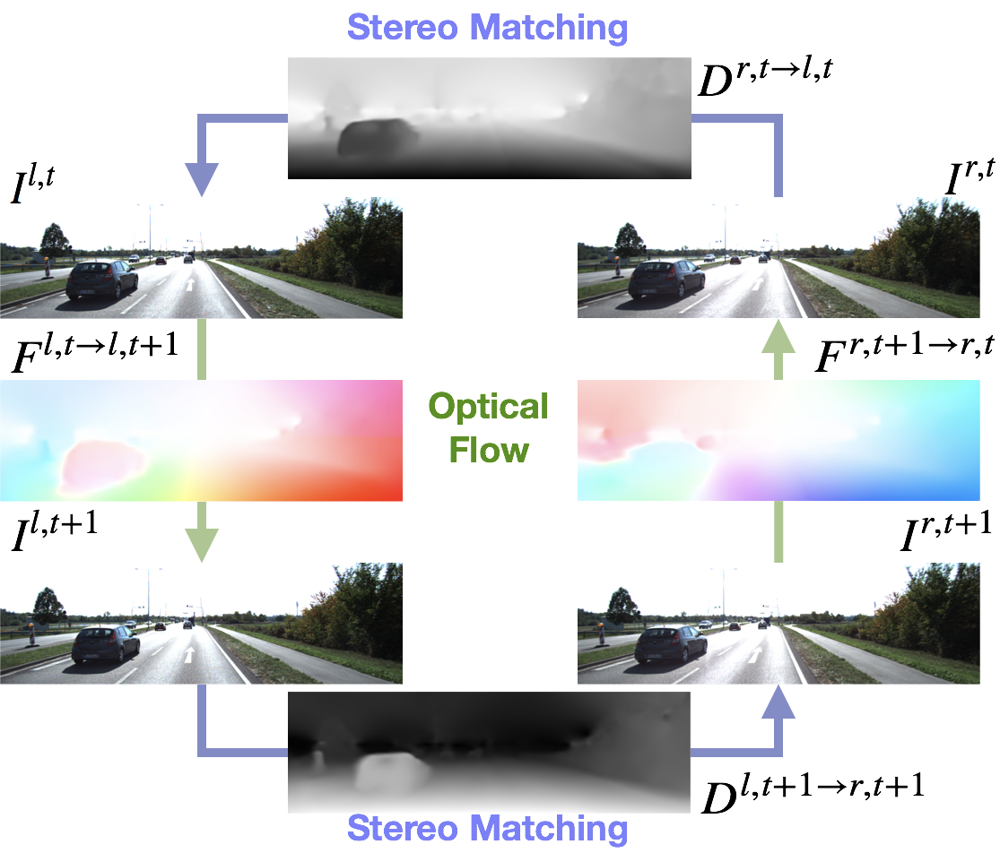

## Education

---
 M.S., Institue of Networking Engineering, <a href="https://www.nctu.edu.tw/">National Chiao-Tung University</a>

 B.S., <a href="http://www.csie.ntu.edu.tw/">Computer Science and Information Engineering</a>, <a href="http://www.ntu.edu.tw/">National Taiwan University</a>

 <a href="http://www.tcfsh.tc.edu.tw/">Taichung First Senior High School</a>

---

## Experiences

---
* Teaching Assistant, Computer Vision, NCTU, Spring 2019
* Teaching Assistant, Machine Learning, NCTU, Fall 2018
* Software Engineer Intern, DiQi Taiwan, Jul. 2015 - Oct. 2015

---

## Publications

---
* *Hsueh-Ying Lai*, Yi-Hsuan Tsai, Wen-Chen Chiu. [Bridging Stereo Matching and Optical Flow via Spatiotemporal Correspondence](https://arxiv.org/abs/1905.09265). In International Conference on Computer Vision and Pattern Recognition (CVPR), 2019. [Code](https://github.com/lelimite4444/BridgeDepthFlow/)

---

Page template forked from <a href="https://github.com/evanca/quick-portfolio">evanca</a>

<!-- Remove above link if you don't want to attibute -->
